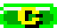
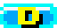
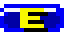
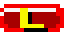
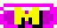
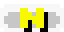
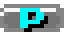
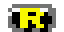
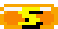
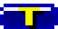

# Paranoid

An Arkanoid clone started in 2014, rescued in 2026 and ported from SFML
to SDL3. Break the wall, catch the capsules, chase the high score.

## Running

```sh
make run        # build (Debug) and launch
make release    # optimized build
make dev        # build and launch with developer cheats (DEV_MODE)
make help       # every target
```

Dependencies (Fedora): `SDL3-devel SDL3_image-devel gtest-devel cmake gcc-c++`.

## Controls

| Action                          | Keyboard        | Mouse      | Gamepad        |
|---------------------------------|-----------------|------------|----------------|
| Move the paddle                 | ← / →           | move       | left stick / d-pad |
| Release the ball / fire lasers  | Space           | left click | south button   |
| Pause (Resume / Main menu / Quit) | Escape        | —          | Start          |
| Fullscreen                      | F11             | —          | —              |
| Menus: navigate / adjust / pick | arrows / Enter  | hover / click | d-pad / south |

The paddle follows the mouse at the same top speed as the keyboard —
no input is faster than another.

## Capsules

10% of destroyed bricks drop a capsule. Mode capsules (marked ⏱) last
10 seconds and any new capsule cancels the one in effect.

| Capsule | Effect |
|---------|--------|
|  | **Break** — jump straight to the next stage |
|  | **Catch** ⏱ — the paddle holds the ball; release with Space |
|  | **Disruption** — the ball splits in three |
|  | **Expand** ⏱ — wider paddle |
|  | **Laser** ⏱ — the paddle fires with Space |
|  | **Megaball** ⏱ — the ball smashes through bricks without bouncing |
|  | **Net** ⏱ — a barrier on the floor bounces the ball back |
|  | **Speed up** — faster balls |
|  | **Reduce** ⏱ — narrower paddle |
|  | **Slow** — slower balls |
|  | **Twist** ⏱ — a moving paddle puts spin on the ball (Magnus curve) |
|  | **Extra life** |

## Scoring

A brick is worth 10 points per life it takes to kill — silver (2 lives)
scores 20, gold (3) scores 30 — awarded only when it dies. Chipping a
life scores nothing, and indestructible bricks never score. The high
score persists across runs.

## Stages

Stages are plain-text ASCII art in [`media/stages/`](media/stages/):
15 lines of 15 characters, one per brick, played in filename order.
See [media/stages/README.md](media/stages/README.md) for the legend —
add a `.txt` file and it is in the game.

## Map editor

`EDITOR` on the main menu opens the stage editor:

```
MOVE: ARROWS | PAINT: ENTER | ERASE: DEL | TYPE: Q/E
SAVE: S | LOAD: L | MENU: ESC
```

It saves to `~/.local/share/paranoid/custom.map` in the stage-file
format, so a finished map ships by copying it into `media/stages/`.

## Options

Scale mode (letterbox keeps the aspect, stretch fills the window),
fullscreen, and separate music / effects volumes, adjusted with ← / →.
Settings and the high score persist under `~/.local/share/paranoid/`.

## Development

The code is split in two layers: `src/engine/` is a small reusable,
SFML-shaped façade over SDL3 (window, sprites, text, audio, gamepad),
and `src/C*.{hpp,cpp}` is the game itself (states, entities, menus).

```sh
make test        # ~100 GoogleTest cases, headless (dummy SDL drivers)
make sanitize    # test suite under ASan/UBSan
make leak-check  # tests + a game smoke run under valgrind
make format      # clang-format over every source
```

CI builds and tests every push on Linux x86_64, Linux arm64 and
Windows (MSYS2), and uploads playable artifacts for each platform.
